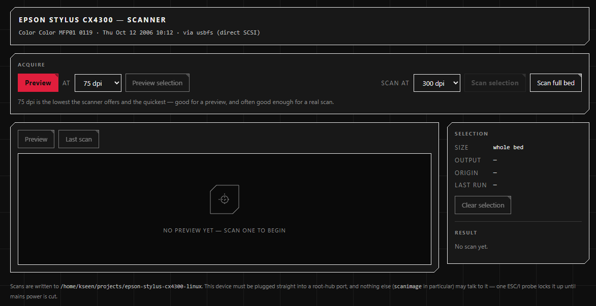
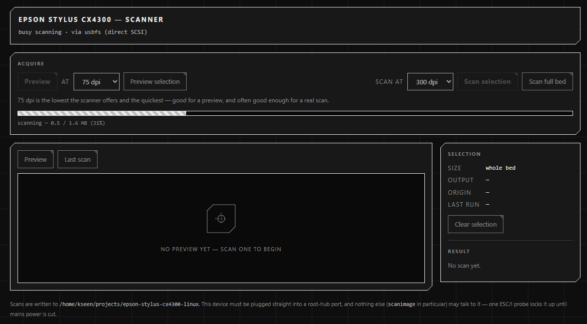
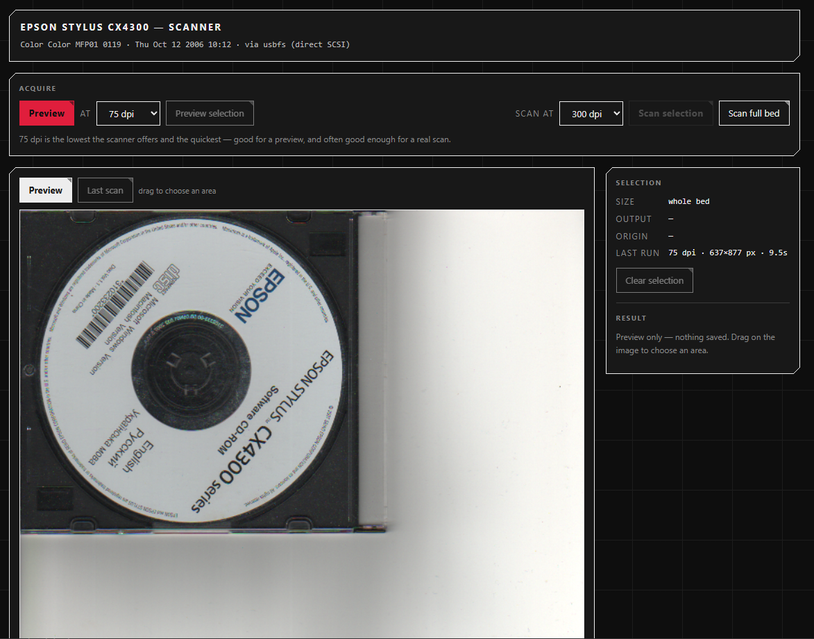
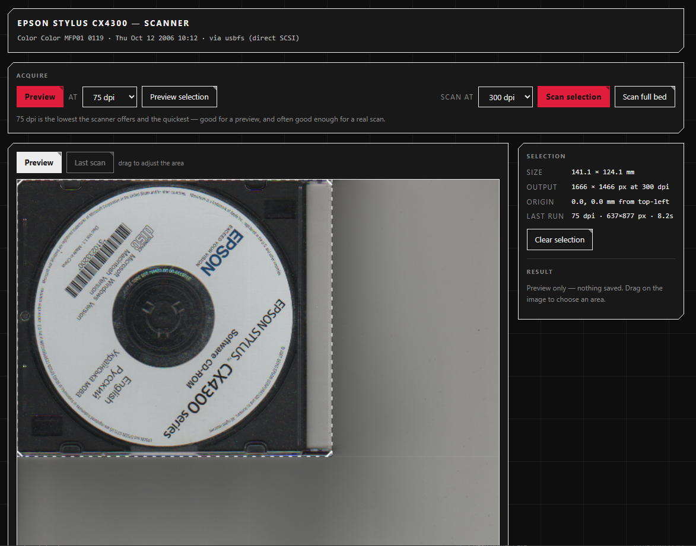
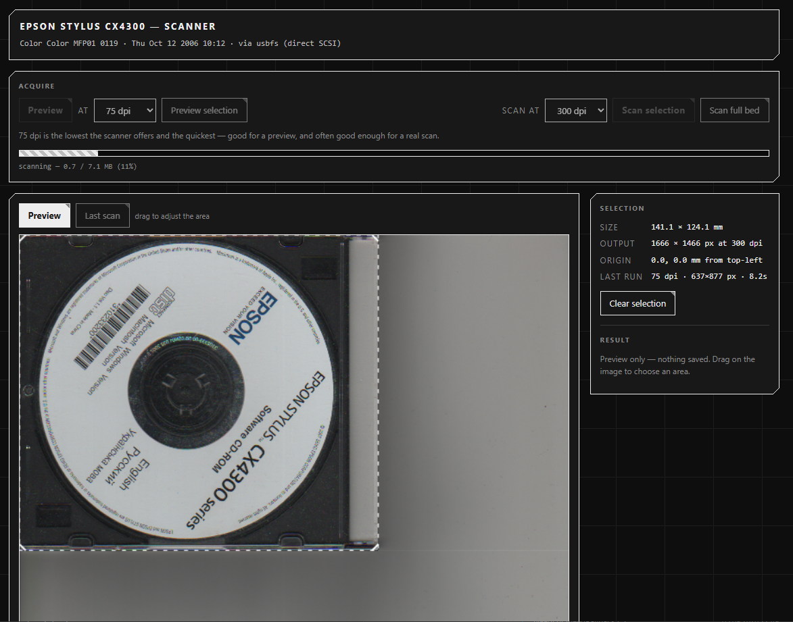
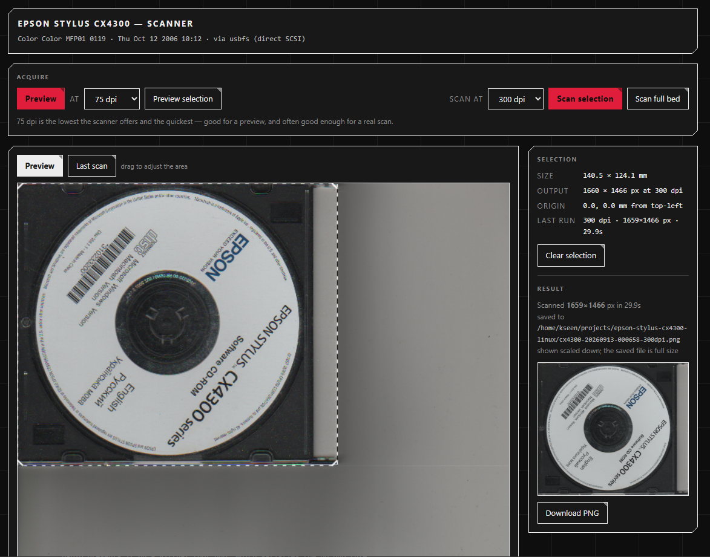
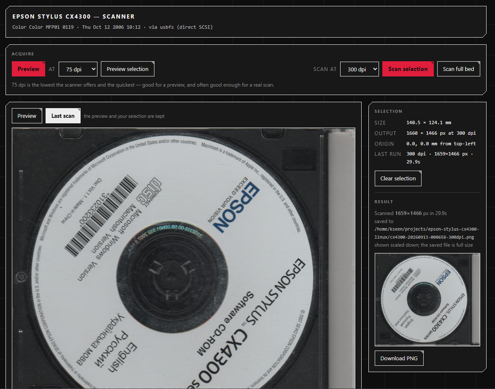

# Epson Stylus CX4300 scanner on Linux (and Windows)

The scanner half of the Epson Stylus CX4300 family (`04b8:083f`, shared with the
CX4400, CX5500, CX5600, DX4400 and DX4450) does not work with Epson's own Linux
driver. This repository contains the reverse-engineered protocol, a Go library
that implements it, a SANE backend so ordinary scanning applications can use the
device, and a small web UI to scan with.

Works on Linux (direct USB) and Windows (through WIA).

## What's here

| Path | What it is |
|---|---|
| `cx4300/` | the protocol as an importable Go library (`Scan`, or `ScanRows` for the image row by row as it arrives) |
| `cmd/escan/` | web UI: preview, crop, scan |
| `cmd/libsane-cx4300/` | SANE backend, so XSane, GIMP, simple-scan and `scanimage` work |
| `install.sh` / `install.ps1` | installers (`--service` / `-Service` also runs it in the background) |
| `examples/` | systemd units and the Windows logon task, ready to edit by hand |
| [PROTOCOL.md](PROTOCOL.md) | the wire protocol, in detail |
| [FINDINGS.md](FINDINGS.md) | how it was worked out, and everything ruled out |
| `tools/escan.py` | the original Python proof of concept, kept as reference |
| `image/` | UI screenshots used below (`image/raw/` holds the uncropped originals) |

## The interface

The whole flow, in order: preview, drag a crop on it, then scan the selection at
whatever resolution you want.

The Mode buttons choose colour or grey. Grey is computed from the colour the
device scans - see the SANE section below for what that is good for - and
`--gray` (or `gray = true` in the settings file) preselects it.

**Nothing scanned yet.** The scanner identifies itself in the masthead, so you
know it is reachable before starting.



**Preview running.** The image is drawn row by row as the carriage moves: the
server streams it at display size while the device is still scanning. Progress
is reported in megabytes as the data arrives; a 75 dpi full bed takes about 8
seconds.



**Preview.** The whole platen at 75 dpi. This is what you drag on.



**Area selected.** The panel
reports the selection in millimetres, the output size in pixels at the chosen
resolution, and its origin on the glass.



**Scan running.** The scan appears as it is made, and the selection stays put,
so the area can be adjusted and re-scanned without previewing again. What is
drawn while scanning is pixel for pixel what replaces it at the end - both are
the same integer box average of the full-resolution image, which is saved to
disk at full size regardless.



**Finished.** The result is saved to disk at full resolution and thumbnailed in
the side panel.



**Last scan.** Switching the view shows the result at full width.



## Install

Linux, from a release - no toolchain needed:

```sh
chmod +x escan-v20260913.1-linux-x86_64.run
sudo ./escan-v20260913.1-linux-x86_64.run   # add --service to run it from boot
escan                                       # then open http://127.0.0.1:8080/
```

Each `.run` is a self-extracting installer holding the binary, the installer and
the example unit files; `--extract DIR` unpacks it without installing anything.
The bare executable is published next to it if you would rather place it
yourself. Files are named `escan-<tag>-linux-<arch>`, where the tag is the
release date and a counter (`v20260913.1`), and every release carries one bare
binary and one `.run` per architecture.

Linux, from source:

```sh
sudo ./install.sh
escan                      # then open http://127.0.0.1:8080/
```

Either way the installer adds a udev rule so the `scanner` group can use the
device without root, installs the SANE backend, and **disables the Epson SANE
backends** (`epkowa`, `epson`, `epson2`, `epsonds`) - see the warning below.
From a source checkout it builds both the binary and the backend; from a `.run`
it installs what is already inside. Pass `--no-sane` to leave SANE alone and
install only the web UI.

Windows:

```powershell
powershell -ExecutionPolicy Bypass -File .\install.ps1
escan
```

### The HTTP interface

Everything the page does, a script can do. `http://127.0.0.1:8080/docs` lists
every endpoint with its body, its answers and a `curl` line for each, and
`/api/openapi.json` is the same thing as a machine-readable document. Both are
generated from the table escan registers its own endpoints from, so they
describe the build that is serving them.

### Running it as a service

Optional - it is a foreground program by default. Pass the flag and it keeps
serving `http://127.0.0.1:8080/` from boot (Linux) or from logon (Windows),
writing scans to `~/scans`:

```sh
sudo ./install.sh --service        # systemd unit, runs as the user who invoked sudo
```

```powershell
powershell -ExecutionPolicy Bypass -File .\install.ps1 -Service
```

Windows has no user-session service, so there it is a Scheduled Task that starts
at logon; WIA scanning needs the interactive session anyway.

The unit files are in [`examples/systemd/`](examples/systemd/) - the system-wide
`escan.service` the installer renders, and `escan.user.service` for a per-user
one that starts and stops with your login. The Windows task definition is
[`examples/windows/escan-logon-task.xml`](examples/windows/escan-logon-task.xml).

```sh
systemctl status escan       # is it up
journalctl -u escan -f       # what it is doing
sudo systemctl disable --now escan
```

### Configuration file

escan reads `/etc/escan.conf` at startup if it exists (`C:\ProgramData\escan\escan.conf`
on Windows, `--config` elsewhere). Every key is also a command-line flag, and a
flag given explicitly wins over the file. An unknown key is refused at startup
rather than ignored. The commented template is [`examples/escan.conf`](examples/escan.conf),
which `install.sh --service` drops in for you at mode 0600.

Because flags win, **the systemd unit passes none** - everything, the listen
address included, comes from the config file, so changing a setting is an edit
there and `systemctl restart escan`. A unit carrying `--addr` would quietly
ignore the `addr` line in the file. `WorkingDirectory` in the unit is what `out`
falls back to.

```ini
# /etc/escan.conf
addr = 0.0.0.0:8080     # reachable from the LAN; see the warning below
out  = /home/you/scans
```

With no login configured, anything that can reach the address can scan and can
download everything in the output directory. `127.0.0.1:8080` is the default for
that reason - before widening it, set a login.

### Login

Set a user and a password and escan serves a login page and refuses every
request without a valid token. Set neither and it runs open, as before.

```ini
# /etc/escan.conf, mode 0600
auth-user     = you
auth-password = secret

# Optional:
auth-ttl         = 15m     # life of the token every request carries
auth-refresh-ttl = 8760h   # how long the browser stays signed in
jwt-secret       = <64 hex characters>
```

Signing in issues two HS256 JWTs as `HttpOnly`, `SameSite=Strict` cookies: a
short-lived access token that every request carries, and a long-lived refresh
token that does nothing but renew it. A request arriving with an expired access
token and a good refresh token is renewed in passing, so a leaked access token
is worthless within the quarter hour while the browser at home stays signed in
for a year.

- **The password and the signing key are config-file only.**
  An argument is visible to every user on the machine through
  `/proc`. escan refuses to start if the file holding either is readable by
  anyone else.
- **`jwt-secret` is optional.** Left unset, escan generates one at startup,
  which signs everyone out on every restart. Set it - `openssl rand -hex 32` -
  to keep logins across restarts.
- **Scripts can use it too.** `POST /api/login` with
  `{"user":..., "password":...}` returns both tokens as JSON; send the access
  token as `Authorization: Bearer`, and trade the refresh token for a new pair
  at `POST /api/refresh` when it expires. `/docs` marks which endpoints are
  reachable without one.
- **This is not a substitute for TLS.** The cookies are not `Secure`, because
  escan is normally reached over plain HTTP on a LAN. Put it behind a reverse
  proxy with a certificate if it crosses anything less trusted than that.

### Writing scans to a Samba share

Set an SMB address in the config file and escan writes there itself - no cifs
mount, no `mount.cifs`, no root, and no mount unit to order the service after:

```ini
# /etc/escan.conf, mode 0600
smb-address  = //nas.lan/scans/cx4300
smb-user     = scanuser
smb-password = secret
smb-domain   = WORKGROUP
```

The address is `//host/share`, optionally `//host:port/share/subdir`; the
subdirectory must already exist. `out` is ignored while `smb-address` is set,
and the Download link reads the file back off the share.

Two things worth knowing:

- **The password is config-file only.** There is deliberately no
  `--smb-password` flag. escan refuses to start if the file holding it is readable by
  anyone but its owner; `chmod 600 /etc/escan.conf`.
- **The share is proven at startup.** A wrong address, password or share name
  fails immediately. With
  `Restart=on-failure` in the unit, a NAS that is still booting is retried.

## Calibrating your own scanner

One part of the decode is per unit rather than per model: the sensor reads its
three colour planes on slightly different rows, and by how much is a property of
the individual scanner. The built-in numbers were measured on the unit this
driver was written against. Another unit may differ, and if it does, colour
comes out fringed on fine detail.

Put a printed page on the glass against the top-left corner - text, a table,
anything with detail running across it - and run:

```sh
sudo escan calibrate
```

It scans a 3 x 2 inch window once at each resolution the device offers, and for
each one it:

* checks the wire line length against the padding rule the decode assumes. That
  rule was measured on one unit; if yours pads differently every image it
  produces is sheared, colour is the least of the problem, and the sweep stops
  rather than storing numbers for a scanner that cannot decode at all.
* measures how far green and blue trail red, and how well that measurement
  correlated.
* reads the channel levels, and warns if they are more than a few counts apart.
  This driver applies no per-channel gain, because the unit it was written
  against needed none; a unit that does need it would show up here.

The four measurements are then combined, weighted by how well each aligned, and
the spread between them reported - the lag does not vary with resolution, so a
wide spread is a sign to distrust the result. Finally it applies the calibration
it arrived at back to the captures it came from and checks that it leaves the
planes better aligned than whatever was in force before. If it does not, nothing
is written: measuring a number and that number helping are different things.

The result goes to `/etc/escan-calibration.json`. Both escan and the SANE
backend read it at startup, so calibrating once serves the web UI and every SANE
frontend. `--quick` measures at 300 dpi only, which is faster and skips the
cross-resolution agreement check. To see what is in force without scanning:

```sh
escan calibrate --show
```

```
built-in:  green 0.17, blue 0.90
stored:    green 0.21, blue 0.88   <- in force
           from /etc/escan-calibration.json
           measured Thu, 17 Sep 2026 23:00:00 MSK
           on "Color   Color MFP01     0119"
           correlation green 0.981, blue 0.974
           spread across resolutions green 0.07, blue 0.12
```

`--dry-run` measures and prints without writing. `--calibration <path>` puts the
file somewhere else - useful without root - and `escan --calibration <path>`,
or `calibration = <path>` in the settings file, makes the server read it from
there; the SANE backend takes `CX4300_CALIBRATION` in the environment.

It will not write a guess. A blank sheet or an empty platen has no detail to
align, and a plane it could not measure keeps its previous value and says so;
if neither plane could be measured, nothing is written and it exits non-zero. A
corrupt or out-of-range file is refused at startup with a warning, and the
built-in values stay in force rather than wrong colour being applied quietly.

The calibration is deliberately not per resolution. Measured across 75, 150, 300
and 600 dpi, the plane lag, the horizontal registration and the channel gains
were the same at every resolution - the lag is in wire lines, not in inches - so
one set of numbers serves them all. See [PROTOCOL.md](PROTOCOL.md).

## Scanning from ordinary applications

The SANE backend (`libsane-cx4300.so.1`) makes the scanner look like any other
to XSane, GIMP, simple-scan, Document Scanner, `scanimage` and anything else
built on SANE:

```sh
scanimage -L                                   # cx4300:cx4300 ... flatbed scanner
scanimage --resolution 300 --format=png > a.png
scanimage --resolution 150 -l 20 -t 30 -x 100 -y 150 --format=png > crop.png
```

It offers `resolution` (75, 150, 300 or 600 dpi), `mode` (`Color` or `Gray`),
`oversample`, and the four geometry options `-l/-t/-x/-y` in millimetres.

```sh
scanimage --mode Gray --resolution 300 --format=png > page.png
```

`oversample` is on by default and matters below 300 dpi. The sensor reads its
three colour planes on different rows, and under 300 dpi the device subsamples
rather than averaging, so each plane aliases fine detail differently and thin
near-horizontal lines come out fringed with colour - badly at 75 dpi, visibly
at 150. Scanning at 300 and averaging down removes it. Measured as the mean
channel difference over one window of line art, for a 75 dpi result: 33.1
counts scanned natively, 17.1 taken from 300 dpi. Taking it from 600 gives
17.0, so 300 is where it stops paying. The cost is the 300 dpi sweep's time;
turn it off with `--oversample=false` (escan) or `--oversample=no` (scanimage)
if speed matters more. It does nothing at 300 dpi or above, and previews in the
web UI never oversample - framing is what a preview is for.

The hardware itself only ever scans 24-bit colour, so `Gray` is computed here:
each pixel becomes the luma average of the three colour planes. It is worth
asking for on a grey or black-and-white original - text, documents, receipts -
because averaging the three channels cancels most of the per-channel noise that
otherwise shows up as colour speckle on a neutral page, and the frontend reads
a third of the bytes. It does not make the scan itself any faster: the same
colour data crosses the USB link either way.

The backend claims the USB device only while a scan is running, so the web UI
and a SANE frontend can both be open at once - whichever starts a scan first
gets the device, and the other is told it is busy. Cancelling a scan stops the
rows reaching the frontend but deliberately lets the transfer finish in the
background, because a device abandoned mid-transfer wedges until its mains power
is cut.

When something goes wrong, SANE gives a frontend a status code and nothing else,
so the backend also writes an explanation to stderr - run the frontend from a
terminal to see it.

## Two things this scanner insists on

Both cost a lot of debugging time, and neither is a software bug.

**Never let an ESC/I backend touch it.** `epkowa` - and Epson's `epson`,
`epson2` and `epsonds` - open by probing with ESC/I (`1b 66`). This device does
not implement ESC/I, and that probe is an invalid SCSI command which latches the
scanner into refusing *everything* until mains power is removed. A single
`scanimage -L` is enough, because that loads every enabled backend. Re-plugging
USB does not clear it. `install.sh` disables those backends for you, which is
what makes the `cx4300` backend safe to enable; the library reports this state
as `ErrLatched`.

**Plug it straight into a root-hub port.** Behind any USB hub its identify step
fails and the scan area reads back as zero. Internal hubs count - Intel
rate-matching hubs and the internal hub on many USB 3 add-in cards included.

If it stops responding, or ignores its own power button, unplug it from mains
for ~30 seconds.

## Running it from WSL

`usbipd-win` hands the device to Linux, and it arrives on a virtual root hub,
which satisfies the no-hub rule. In an Administrator PowerShell:

```powershell
usbipd list
usbipd bind --force --busid <busid>    # --force if USBPcap is installed
usbipd attach --wsl --busid <busid>
```

`lsusb` in WSL should then show `04b8:083f` directly under a root hub. To hand
it back to Windows, `usbipd detach --busid <busid>` - and note that after a
detach Windows usually needs the USB cable physically replugged before it will
use the scanner again.

## Status and limitations

Verified on both platforms against real hardware: identify, 75 dpi preview,
cropped scans at 300 and 600 dpi and full-bed scans at 150 dpi, through the web
UI and through SANE. Linux and Windows produce the same framing and the same
output dimensions. The plane padding rule was measured from raw wire data at
fourteen width/resolution combinations - including the width that tells a
16-pixel rule apart from 32 and 64, and the six that establish the extra block
600 dpi adds - see [PROTOCOL.md](PROTOCOL.md).

Not timed: a 600 dpi **full bed**, which is ~107 MB over this device's USB 1.1
link. Crops at 600 dpi are verified; give a full bed several minutes before
assuming a timeout is a bug.

The SANE backend is a cgo shared library, so releases carry one only for the
architectures the build has a C compiler for (x86_64 and aarch64); on any other
architecture `install.sh` builds it from source, and skips it if no C compiler
is available. It is Linux-only - on Windows the same applications reach the
scanner through Epson's own WIA driver.
